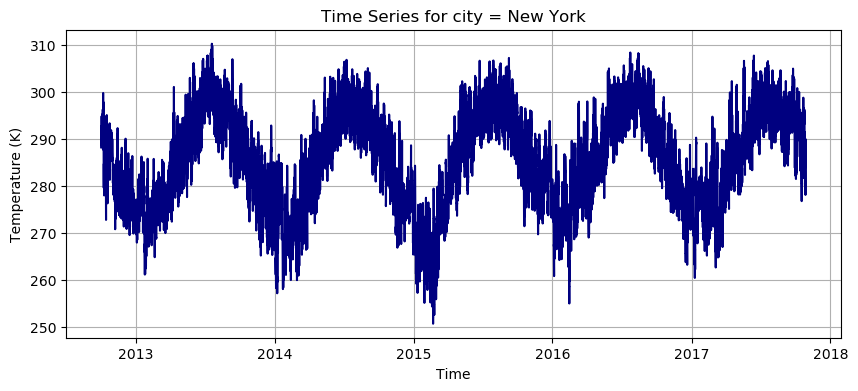

# Hands on Modeling Rare Events in Time Series, with Python

## Raw Data Display


```python
!pip install dataframe_image
```

    Collecting dataframe_image
      Downloading dataframe_image-0.2.7-py3-none-any.whl.metadata (9.3 kB)
    Requirement already satisfied: pandas>=0.24 in /Users/pieropaialunga/miniforge3/lib/python3.10/site-packages (from dataframe_image) (2.1.4)
    Requirement already satisfied: nbconvert>=5 in /Users/pieropaialunga/miniforge3/lib/python3.10/site-packages (from dataframe_image) (7.13.0)
    Collecting aiohttp>=3.10.2 (from dataframe_image)
      Downloading aiohttp-3.12.13-cp310-cp310-macosx_11_0_arm64.whl.metadata (7.6 kB)
    Requirement already satisfied: requests in /Users/pieropaialunga/miniforge3/lib/python3.10/site-packages (from dataframe_image) (2.32.3)
    Requirement already satisfied: pillow in /Users/pieropaialunga/miniforge3/lib/python3.10/site-packages (from dataframe_image) (9.3.0)
    Requirement already satisfied: packaging in /Users/pieropaialunga/miniforge3/lib/python3.10/site-packages (from dataframe_image) (21.3)
    Requirement already satisfied: mistune in /Users/pieropaialunga/miniforge3/lib/python3.10/site-packages (from dataframe_image) (3.0.2)
    Requirement already satisfied: lxml in /Users/pieropaialunga/miniforge3/lib/python3.10/site-packages (from dataframe_image) (5.3.0)
    Requirement already satisfied: beautifulsoup4 in /Users/pieropaialunga/miniforge3/lib/python3.10/site-packages (from dataframe_image) (4.12.2)
    Collecting cssutils (from dataframe_image)
      Downloading cssutils-2.11.1-py3-none-any.whl.metadata (8.7 kB)
    Collecting playwright (from dataframe_image)
      Downloading playwright-1.52.0-py3-none-macosx_11_0_arm64.whl.metadata (3.5 kB)
    Collecting cssselect (from dataframe_image)
      Downloading cssselect-1.3.0-py3-none-any.whl.metadata (2.6 kB)
    Collecting aiohappyeyeballs>=2.5.0 (from aiohttp>=3.10.2->dataframe_image)
      Downloading aiohappyeyeballs-2.6.1-py3-none-any.whl.metadata (5.9 kB)
    Requirement already satisfied: aiosignal>=1.1.2 in /Users/pieropaialunga/miniforge3/lib/python3.10/site-packages (from aiohttp>=3.10.2->dataframe_image) (1.3.1)
    Requirement already satisfied: async-timeout<6.0,>=4.0 in /Users/pieropaialunga/miniforge3/lib/python3.10/site-packages (from aiohttp>=3.10.2->dataframe_image) (4.0.3)
    Requirement already satisfied: attrs>=17.3.0 in /Users/pieropaialunga/miniforge3/lib/python3.10/site-packages (from aiohttp>=3.10.2->dataframe_image) (23.1.0)
    Requirement already satisfied: frozenlist>=1.1.1 in /Users/pieropaialunga/miniforge3/lib/python3.10/site-packages (from aiohttp>=3.10.2->dataframe_image) (1.4.1)
    Requirement already satisfied: multidict<7.0,>=4.5 in /Users/pieropaialunga/miniforge3/lib/python3.10/site-packages (from aiohttp>=3.10.2->dataframe_image) (6.0.5)
    Collecting propcache>=0.2.0 (from aiohttp>=3.10.2->dataframe_image)
      Downloading propcache-0.3.2-cp310-cp310-macosx_11_0_arm64.whl.metadata (12 kB)
    Collecting yarl<2.0,>=1.17.0 (from aiohttp>=3.10.2->dataframe_image)
      Downloading yarl-1.20.1-cp310-cp310-macosx_11_0_arm64.whl.metadata (73 kB)
    Requirement already satisfied: idna>=2.0 in /Users/pieropaialunga/miniforge3/lib/python3.10/site-packages (from yarl<2.0,>=1.17.0->aiohttp>=3.10.2->dataframe_image) (3.4)
    Requirement already satisfied: bleach!=5.0.0 in /Users/pieropaialunga/miniforge3/lib/python3.10/site-packages (from nbconvert>=5->dataframe_image) (6.1.0)
    Requirement already satisfied: defusedxml in /Users/pieropaialunga/miniforge3/lib/python3.10/site-packages (from nbconvert>=5->dataframe_image) (0.7.1)
    Requirement already satisfied: jinja2>=3.0 in /Users/pieropaialunga/miniforge3/lib/python3.10/site-packages (from nbconvert>=5->dataframe_image) (3.1.2)
    Requirement already satisfied: jupyter-core>=4.7 in /Users/pieropaialunga/miniforge3/lib/python3.10/site-packages (from nbconvert>=5->dataframe_image) (5.5.1)
    Requirement already satisfied: jupyterlab-pygments in /Users/pieropaialunga/miniforge3/lib/python3.10/site-packages (from nbconvert>=5->dataframe_image) (0.3.0)
    Requirement already satisfied: markupsafe>=2.0 in /Users/pieropaialunga/miniforge3/lib/python3.10/site-packages (from nbconvert>=5->dataframe_image) (2.1.2)
    Requirement already satisfied: nbclient>=0.5.0 in /Users/pieropaialunga/miniforge3/lib/python3.10/site-packages (from nbconvert>=5->dataframe_image) (0.9.0)
    Requirement already satisfied: nbformat>=5.7 in /Users/pieropaialunga/miniforge3/lib/python3.10/site-packages (from nbconvert>=5->dataframe_image) (5.9.2)
    Requirement already satisfied: pandocfilters>=1.4.1 in /Users/pieropaialunga/miniforge3/lib/python3.10/site-packages (from nbconvert>=5->dataframe_image) (1.5.0)
    Requirement already satisfied: pygments>=2.4.1 in /Users/pieropaialunga/miniforge3/lib/python3.10/site-packages (from nbconvert>=5->dataframe_image) (2.17.2)
    Requirement already satisfied: tinycss2 in /Users/pieropaialunga/miniforge3/lib/python3.10/site-packages (from nbconvert>=5->dataframe_image) (1.2.1)
    Requirement already satisfied: traitlets>=5.1 in /Users/pieropaialunga/miniforge3/lib/python3.10/site-packages (from nbconvert>=5->dataframe_image) (5.14.0)
    Requirement already satisfied: six>=1.9.0 in /Users/pieropaialunga/miniforge3/lib/python3.10/site-packages (from bleach!=5.0.0->nbconvert>=5->dataframe_image) (1.16.0)
    Requirement already satisfied: webencodings in /Users/pieropaialunga/miniforge3/lib/python3.10/site-packages (from bleach!=5.0.0->nbconvert>=5->dataframe_image) (0.5.1)
    Requirement already satisfied: platformdirs>=2.5 in /Users/pieropaialunga/miniforge3/lib/python3.10/site-packages (from jupyter-core>=4.7->nbconvert>=5->dataframe_image) (4.2.2)
    Requirement already satisfied: jupyter-client>=6.1.12 in /Users/pieropaialunga/miniforge3/lib/python3.10/site-packages (from nbclient>=0.5.0->nbconvert>=5->dataframe_image) (8.6.0)
    Requirement already satisfied: python-dateutil>=2.8.2 in /Users/pieropaialunga/miniforge3/lib/python3.10/site-packages (from jupyter-client>=6.1.12->nbclient>=0.5.0->nbconvert>=5->dataframe_image) (2.8.2)
    Requirement already satisfied: pyzmq>=23.0 in /Users/pieropaialunga/miniforge3/lib/python3.10/site-packages (from jupyter-client>=6.1.12->nbclient>=0.5.0->nbconvert>=5->dataframe_image) (25.1.2)
    Requirement already satisfied: tornado>=6.2 in /Users/pieropaialunga/miniforge3/lib/python3.10/site-packages (from jupyter-client>=6.1.12->nbclient>=0.5.0->nbconvert>=5->dataframe_image) (6.2)
    Requirement already satisfied: fastjsonschema in /Users/pieropaialunga/miniforge3/lib/python3.10/site-packages (from nbformat>=5.7->nbconvert>=5->dataframe_image) (2.19.0)
    Requirement already satisfied: jsonschema>=2.6 in /Users/pieropaialunga/miniforge3/lib/python3.10/site-packages (from nbformat>=5.7->nbconvert>=5->dataframe_image) (4.20.0)
    Requirement already satisfied: jsonschema-specifications>=2023.03.6 in /Users/pieropaialunga/miniforge3/lib/python3.10/site-packages (from jsonschema>=2.6->nbformat>=5.7->nbconvert>=5->dataframe_image) (2023.11.2)
    Requirement already satisfied: referencing>=0.28.4 in /Users/pieropaialunga/miniforge3/lib/python3.10/site-packages (from jsonschema>=2.6->nbformat>=5.7->nbconvert>=5->dataframe_image) (0.32.0)
    Requirement already satisfied: rpds-py>=0.7.1 in /Users/pieropaialunga/miniforge3/lib/python3.10/site-packages (from jsonschema>=2.6->nbformat>=5.7->nbconvert>=5->dataframe_image) (0.15.2)
    Requirement already satisfied: numpy<2,>=1.22.4 in /Users/pieropaialunga/miniforge3/lib/python3.10/site-packages (from pandas>=0.24->dataframe_image) (1.23.5)
    Requirement already satisfied: pytz>=2020.1 in /Users/pieropaialunga/miniforge3/lib/python3.10/site-packages (from pandas>=0.24->dataframe_image) (2023.3.post1)
    Requirement already satisfied: tzdata>=2022.1 in /Users/pieropaialunga/miniforge3/lib/python3.10/site-packages (from pandas>=0.24->dataframe_image) (2023.4)
    Requirement already satisfied: soupsieve>1.2 in /Users/pieropaialunga/miniforge3/lib/python3.10/site-packages (from beautifulsoup4->dataframe_image) (2.5)
    Requirement already satisfied: more-itertools in /Users/pieropaialunga/miniforge3/lib/python3.10/site-packages (from cssutils->dataframe_image) (10.4.0)
    Requirement already satisfied: pyparsing!=3.0.5,>=2.0.2 in /Users/pieropaialunga/miniforge3/lib/python3.10/site-packages (from packaging->dataframe_image) (3.0.9)
    Collecting pyee<14,>=13 (from playwright->dataframe_image)
      Downloading pyee-13.0.0-py3-none-any.whl.metadata (2.9 kB)
    Collecting greenlet<4.0.0,>=3.1.1 (from playwright->dataframe_image)
      Downloading greenlet-3.2.3-cp310-cp310-macosx_11_0_universal2.whl.metadata (4.1 kB)
    Requirement already satisfied: typing-extensions in /Users/pieropaialunga/miniforge3/lib/python3.10/site-packages (from pyee<14,>=13->playwright->dataframe_image) (4.13.2)
    Requirement already satisfied: charset-normalizer<4,>=2 in /Users/pieropaialunga/miniforge3/lib/python3.10/site-packages (from requests->dataframe_image) (2.1.1)
    Requirement already satisfied: urllib3<3,>=1.21.1 in /Users/pieropaialunga/miniforge3/lib/python3.10/site-packages (from requests->dataframe_image) (2.4.0)
    Requirement already satisfied: certifi>=2017.4.17 in /Users/pieropaialunga/miniforge3/lib/python3.10/site-packages (from requests->dataframe_image) (2023.5.7)
    Downloading dataframe_image-0.2.7-py3-none-any.whl (6.7 MB)
       ━━━━━━━━━━━━━━━━━━━━━━━━━━━━━━━━━━━━━━━━ 6.7/6.7 MB 38.7 MB/s eta 0:00:00
    [?25hDownloading aiohttp-3.12.13-cp310-cp310-macosx_11_0_arm64.whl (466 kB)
    Downloading yarl-1.20.1-cp310-cp310-macosx_11_0_arm64.whl (89 kB)
    Downloading aiohappyeyeballs-2.6.1-py3-none-any.whl (15 kB)
    Downloading propcache-0.3.2-cp310-cp310-macosx_11_0_arm64.whl (43 kB)
    Downloading cssselect-1.3.0-py3-none-any.whl (18 kB)
    Downloading cssutils-2.11.1-py3-none-any.whl (385 kB)
    Downloading playwright-1.52.0-py3-none-macosx_11_0_arm64.whl (38.0 MB)
       ━━━━━━━━━━━━━━━━━━━━━━━━━━━━━━━━━━━━━━━━ 38.0/38.0 MB 75.1 MB/s eta 0:00:00a 0:00:01
    [?25hDownloading greenlet-3.2.3-cp310-cp310-macosx_11_0_universal2.whl (268 kB)
    Downloading pyee-13.0.0-py3-none-any.whl (15 kB)
    Installing collected packages: pyee, propcache, greenlet, cssutils, cssselect, aiohappyeyeballs, yarl, playwright, aiohttp, dataframe_image
      Attempting uninstall: yarlm╺━━━━━━━━━━━━━━━━━━━━━━━━━━━  3/10 [cssutils]
        Found existing installation: yarl 1.9.4━━━━━━━━━━━━━━━━━━━  3/10 [cssutils]
        Uninstalling yarl-1.9.4:0m━━━━━━━━━━━━━━━━━━━━━━━━━━━  3/10 [cssutils]
          Successfully uninstalled yarl-1.9.4━━━━━━━━━━━━━━━━━━━━━  3/10 [cssutils]
      Attempting uninstall: aiohttp━━━━━╺━━━━━━━━━━━  7/10 [playwright]
        Found existing installation: aiohttp 3.9.3━━━━━━━━━━━  7/10 [playwright]
        Uninstalling aiohttp-3.9.3:━╺━━━━━━━━━━━  7/10 [playwright]
          Successfully uninstalled aiohttp-3.9.30m━━━━━━━━━━━  7/10 [playwright]
       ━━━━━━━━━━━━━━━━━━━━━━━━━━━━━━━━━━━━━━━━ 10/10 [dataframe_image]aywright]
    Successfully installed aiohappyeyeballs-2.6.1 aiohttp-3.12.13 cssselect-1.3.0 cssutils-2.11.1 dataframe_image-0.2.7 greenlet-3.2.3 playwright-1.52.0 propcache-0.3.2 pyee-13.0.0 yarl-1.20.1


```python
temp = data.raw_data
temp = temp[temp.columns.tolist()[0:5]]
```


```python
from data import Data
import pandas as pd
data = Data()
len(data.raw_data.columns.tolist())-1
```


    36


```python
data.plot_city(city = 'New York')
```


    

    


```python
data.plot_distribution_city(city = 'Los Angeles')
```


    

    


## Picking a specific city: 
This is the code to select a specific city in the columns. 


```python
data.isolate_city(city = 'Houston')
processed_data = data.clean_and_preprocess()
processed_data.head()
```


<div>
<style scoped>
    .dataframe tbody tr th:only-of-type {
        vertical-align: middle;
    }

    .dataframe tbody tr th {
        vertical-align: top;
    }

    .dataframe thead th {
        text-align: right;
    }
</style>
<table border="1" class="dataframe">
  <thead>
    <tr style="text-align: right;">
      <th></th>
      <th>y</th>
      <th>datetime</th>
      <th>date</th>
      <th>month</th>
      <th>year</th>
    </tr>
  </thead>
  <tbody>
    <tr>
      <th>1</th>
      <td>288.270000</td>
      <td>2012-10-01 13:00:00</td>
      <td>2012-10-01</td>
      <td>10</td>
      <td>2012</td>
    </tr>
    <tr>
      <th>2</th>
      <td>288.297576</td>
      <td>2012-10-01 14:00:00</td>
      <td>2012-10-01</td>
      <td>10</td>
      <td>2012</td>
    </tr>
    <tr>
      <th>3</th>
      <td>288.334343</td>
      <td>2012-10-01 15:00:00</td>
      <td>2012-10-01</td>
      <td>10</td>
      <td>2012</td>
    </tr>
    <tr>
      <th>4</th>
      <td>288.371111</td>
      <td>2012-10-01 16:00:00</td>
      <td>2012-10-01</td>
      <td>10</td>
      <td>2012</td>
    </tr>
    <tr>
      <th>5</th>
      <td>288.407879</td>
      <td>2012-10-01 17:00:00</td>
      <td>2012-10-01</td>
      <td>10</td>
      <td>2012</td>
    </tr>
  </tbody>
</table>
</div>


## Distribution of rare events:


```python
from rare_events_processor import RareEventsToolbox
rare_events_toolbox = RareEventsToolbox(data = processed_data)
max_values_result = rare_events_toolbox.extract_max_values()
rare_events_toolbox.plot_distributions()
```


    

    


```python
rare_events_toolbox.fit_all_distributions()
best_dist, ranked_scores = rare_events_toolbox.rank_distributions(key = 'day', rank_based_on = 'bic')
ranked_scores

```


<div>
<style scoped>
    .dataframe tbody tr th:only-of-type {
        vertical-align: middle;
    }

    .dataframe tbody tr th {
        vertical-align: top;
    }

    .dataframe thead th {
        text-align: right;
    }
</style>
<table border="1" class="dataframe">
  <thead>
    <tr style="text-align: right;">
      <th></th>
      <th>log_likelihood</th>
      <th>aic</th>
      <th>bic</th>
    </tr>
  </thead>
  <tbody>
    <tr>
      <th>gumbel</th>
      <td>-6143.649930</td>
      <td>12291.299861</td>
      <td>12302.385348</td>
    </tr>
    <tr>
      <th>weibull</th>
      <td>-6143.646327</td>
      <td>12293.292655</td>
      <td>12309.920885</td>
    </tr>
    <tr>
      <th>gev</th>
      <td>-6155.743963</td>
      <td>12317.487925</td>
      <td>12334.116156</td>
    </tr>
  </tbody>
</table>
</div>


```python
rare_events_toolbox.plot_fitted_distribution(key = 'day', dist_type = best_dist)
```


    

    


```python
rare_events_toolbox.plot_qq(key = 'day', dist_type = best_dist)
```


    

    


```python
cities = data.all_cities()
all_cities_dict = {city : {} for city in cities}
for city in cities:
    data.isolate_city(city = city)
    processed_data = data.clean_and_preprocess()
    rare_events_toolbox = RareEventsToolbox(data = processed_data)
    max_values_result = rare_events_toolbox.extract_max_values()
    rare_events_toolbox.fit_all_distributions()
    best_dist, ranked_scores = rare_events_toolbox.rank_distributions(key = 'day', rank_based_on = 'bic')
    all_cities_dict[city] = rare_events_toolbox.distribution_fit[best_dist]['day']

```


```python
all_cities_dict[cities[0]]
```


    {'dist_type': 'gev',
     'param': (0.5440588013153485, 288.2858877212984, 10.868834065510871),
     'dist': <scipy.stats._continuous_distns.genextreme_gen at 0x147eab1c0>,
     'metrics': {'log_likelihood': -6904.515455707107,
      'aic': 13815.030911414215,
      'bic': 13831.659142050321}}


```python
from rare_events_processor import RareEventsToolbox
data = Data()
data.isolate_city(city = cities[0])
processed_data = data.clean_and_preprocess()
rare_events_toolbox = RareEventsToolbox(data = processed_data)
max_values_result = rare_events_toolbox.extract_max_values()
rare_events_toolbox.fit_all_distributions()
best_dist, ranked_scores = rare_events_toolbox.rank_distributions(key = 'day', rank_based_on = 'bic')
ranked_scores
rare_events_toolbox.plot_fitted_distribution(key = 'day', dist_type = best_dist)
```


    

    


```python
all_cities_dict[cities[5]]
```


    {'dist_type': 'weibull_min',
     'param': (10.813778285500355, 221.90226629829428, 76.43154046134636),
     'dist': <scipy.stats._continuous_distns.weibull_min_gen at 0x147eab5e0>,
     'metrics': {'log_likelihood': -6584.323703930169,
      'aic': 13174.647407860339,
      'bic': 13191.275638496445}}


```python
from rare_events_processor import RareEventsToolbox
data = Data()
data.isolate_city(city = cities[5])
processed_data = data.clean_and_preprocess()
rare_events_toolbox = RareEventsToolbox(data = processed_data)
max_values_result = rare_events_toolbox.extract_max_values()
rare_events_toolbox.fit_all_distributions()
best_dist, ranked_scores = rare_events_toolbox.rank_distributions(key = 'day', rank_based_on = 'bic')
ranked_scores
rare_events_toolbox.plot_fitted_distribution(key = 'day', dist_type = best_dist)
```


    

    

